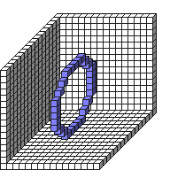

#Circle2DYZ

##Description: Draw 2D Circle on x-Axis <x> <y> <z> <radius>
##Arguments: x y z s

Figure Code:
- [Genesis3D](Genesis3D.md) 16
- [WallCube](WallCube.md) 37
- [PenColorD4](PenColorD4.md) 127 127 255 255
- [Circle2DYZ](Circle2DYZ.md) 7 7 7 5

Condensed: Genesis3D 16;WallCube 37;PenColorD4 127 127 255 255;Circle2DYZ 7 7 7 5

