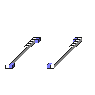

#FilterEdgeVer

##Description: Edge vertical filter
##Arguments: 

Figure Code:
- [Genesis3D](Genesis3D.md) 16
- [PenColorD4](PenColorD4.md) 127 127 255 255
- [Rect](Rect.md) 1 7 1 14 7 14
- [FilterEdgeVer](FilterEdgeVer.md)

Condensed: Genesis3D 16;PenColorD4 127 127 255 255;Rect 1 7 1 14 7 14;FilterEdgeVer

