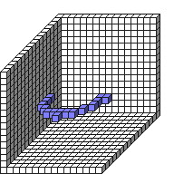
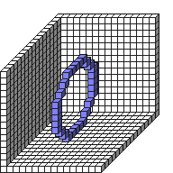
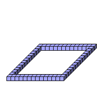
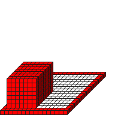
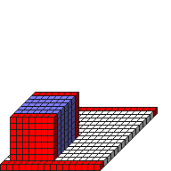
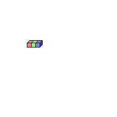
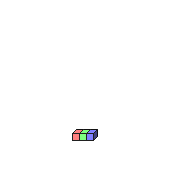
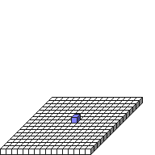
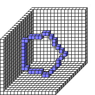

#Glyph Functions

[Alien](Alien.md)

[ArchLine](ArchLine.md)

[ArchPut](ArchPut.md)

[ArchRect](ArchRect.md)

[ArcXY](ArcXY.md)

[ArcXZ](ArcXZ.md)

[ArcYZ](ArcYZ.md)

[BlendBlit1D](BlendBlit1D.md)

[BlendBlit2D](BlendBlit2D.md)

[BlendBlit3D](BlendBlit3D.md)

[Blit1D](Blit1D.md)

[Blit2D](Blit2D.md)

[Blit3D](Blit3D.md)

[Circle2D](Circle2D.md)

[Circle2DXY](Circle2DXY.md)

[Circle2DXZ](Circle2DXZ.md)

[Circle2DYZ](Circle2DYZ.md)

[Circle3D](Circle3D.md)

[Clear](Clear.md)

[CornerSupports](CornerSupports.md)

[Diamond2D](Diamond2D.md)

[EdgeCorners](EdgeCorners.md)

[End](End.md)

[ExtrudeLine](ExtrudeLine.md)

[ExtrudeX](ExtrudeX.md)

[ExtrudeY](ExtrudeY.md)

[ExtrudeZ](ExtrudeZ.md)

[FillCircle2D](FillCircle2D.md)

[FillCircle2DXY](FillCircle2DXY.md)

[FillCircle2DXZ](FillCircle2DXZ.md)

[FillCircle2DYZ](FillCircle2DYZ.md)

[FillCircle3D](FillCircle3D.md)

[FillRect](FillRect.md)

[FillStairs](FillStairs.md)

[FillTriangle](FillTriangle.md)

[FillTriangle2D](FillTriangle2D.md)

[FilterBlur](FilterBlur.md)

[FilterEdgeAll](FilterEdgeAll.md)

[FilterEdgeHor](FilterEdgeHor.md)

[FilterEdgeVer](FilterEdgeVer.md)

[FilterEmboss](FilterEmboss.md)

[FilterMotion](FilterMotion.md)

[FilterSharpen](FilterSharpen.md)

[FilterSmooth](FilterSmooth.md)

[GenChaos](GenChaos.md)

[Genesis3D](Genesis3D.md)

[ImgBrightness](ImgBrightness.md)

[ImgColorize](ImgColorize.md)

[ImgEdge](ImgEdge.md)

[ImgEdgeX](ImgEdgeX.md)

[ImgEdgeY](ImgEdgeY.md)

[ImgEdgeZ](ImgEdgeZ.md)

[ImgFlipX](ImgFlipX.md)

[ImgFlipY](ImgFlipY.md)

[ImgFlipZ](ImgFlipZ.md)

[ImgGrayscale](ImgGrayscale.md)

[ImgHueshift](ImgHueshift.md)

[ImgInvert](ImgInvert.md)

[ImgMirrorX](ImgMirrorX.md)

[ImgMirrorY](ImgMirrorY.md)

[ImgMirrorZ](ImgMirrorZ.md)

[ImgPalettize](ImgPalettize.md)

[ImgRotX](ImgRotX.md)

[ImgRotY](ImgRotY.md)

[ImgRotZ](ImgRotZ.md)

[ImgSaturate](ImgSaturate.md)

[ImgShadeX](ImgShadeX.md)

[ImgShadeY](ImgShadeY.md)

[ImgShadeZ](ImgShadeZ.md)

[Line](Line.md)

[MaskFillRect](MaskFillRect.md)

[MaskRect](MaskRect.md)

[Maze](Maze.md)

[Nop](Nop.md)

[Oval3D](Oval3D.md)

[Pal1D](Pal1D.md)

[Pal2D](Pal2D.md)

[Pal3D](Pal3D.md)

[PalFromGrid1D](PalFromGrid1D.md)

[PalFromGrid2D](PalFromGrid2D.md)

[PalFromGrid3D](PalFromGrid3D.md)

[PalFromVal1D](PalFromVal1D.md)

[PalFromVal2D](PalFromVal2D.md)

[PalFromVal3D](PalFromVal3D.md)

[PalGen1D1](PalGen1D1.md)

[PalGen1D2](PalGen1D2.md)

[PalGen1D3](PalGen1D3.md)

[PalGen1D4](PalGen1D4.md)

[PenColorD1](PenColorD1.md)

[PenColorD2](PenColorD2.md)

[PenColorD3](PenColorD3.md)

[PenColorD4](PenColorD4.md)

[PenDepth](PenDepth.md)

[PenGroup](PenGroup.md)

[PenHatch](PenHatch.md)

[PenHeight](PenHeight.md)

[PenPhysics](PenPhysics.md)

[PenShape](PenShape.md)

[PenSize](PenSize.md)

[PenTex](PenTex.md)

[PenWidth](PenWidth.md)

[Plot](Plot.md)

[Polygon](Polygon.md)

[PrimaRect](PrimaRect.md)

[PrimaRGBA](PrimaRGBA.md)

[PrimaSize](PrimaSize.md)

[Put](Put.md)

[PutGroup](PutGroup.md)

[Pyramid3D](Pyramid3D.md)

[Quad2D](Quad2D.md)

[Rect](Rect.md)

[RectBlit1D](RectBlit1D.md)

[RectBlit2D](RectBlit2D.md)

[RectBlit3D](RectBlit3D.md)

[ScalePut](ScalePut.md)

[Scissor](Scissor.md)

[Shadows](Shadows.md)

[ShapeSmoothX](ShapeSmoothX.md)

[ShapeSmoothY](ShapeSmoothY.md)

[ShapeSmoothZ](ShapeSmoothZ.md)

[ShapeToColor](ShapeToColor.md)

[Size1D1](Size1D1.md)

[Size1D2](Size1D2.md)

[Size1D3](Size1D3.md)

[Size1D4](Size1D4.md)

[Size2D1](Size2D1.md)

[Size2D2](Size2D2.md)

[Size2D3](Size2D3.md)

[Size2D4](Size2D4.md)

[Size3D1](Size3D1.md)

[Size3D2](Size3D2.md)

[Size3D3](Size3D3.md)

[Size3D4](Size3D4.md)

[Spawn](Spawn.md)

[Stairs](Stairs.md)

[Star](Star.md)

[String](String.md)

[Supports](Supports.md)

[Text](Text.md)

[Triangle](Triangle.md)

[TubeXY](TubeXY.md)

[TubeXZ](TubeXZ.md)

[TubeYZ](TubeYZ.md)

[UpV](UpV.md)

[WallCube](WallCube.md)

[Wire](Wire.md)

