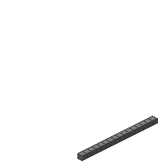

#Size1D1

##Description: Create 1-byte 1D grid of <width>
##Arguments: w

Figure Code:
- [Size1D1](Size1D1.md) 16
- [PenColorD1](PenColorD1.md) 127
- [Clear](Clear.md)

Condensed: Size1D1 16;PenColorD1 127;Clear

