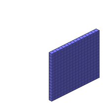

#Size2D4

##Description: Create 4-byte 2D grid of <width> <height>
##Arguments: w h

Figure Code:
- [Size2D4](Size2D4.md) 16 16
- [PenColorD4](PenColorD4.md) 127 127 255 255
- [Clear](Clear.md)

Condensed: Size2D4 16 16;PenColorD4 127 127 255 255;Clear

