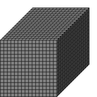

#Size3D1

##Description: Create 1-byte 3D grid of <width> <height> <depth>
##Arguments: w h d

Figure Code:
- [Size3D1](Size3D1.md) 16 16 16
- [PenColorD1](PenColorD1.md) 127
- [Clear](Clear.md)

Condensed: Size3D1 16 16 16;PenColorD1 127;Clear

