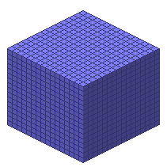

#Size3D4

##Description: Create 4-byte 3D grid of <width> <height> <depth>
##Arguments: w h d

Figure Code:
- [Size3D4](Size3D4.md) 16 16 16
- [PenColorD4](PenColorD4.md) 127 127 255 255
- [Clear](Clear.md)

Condensed: Size3D4 16 16 16;PenColorD4 127 127 255 255;Clear

