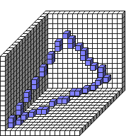

#Triangle

##Description: Draw Triangle <x1> <y1> <z1> <x2> <y2> <z2> <x3> <y3> <z3>
##Arguments: x y z X Y Z # # #

Figure Code:
- [Genesis3D](Genesis3D.md) 16
- [WallCube](WallCube.md) 37
- [PenColorD4](PenColorD4.md) 127 127 255 255
- [Triangle](Triangle.md) 1 1 1 15 5 10 8 15 8

Condensed: Genesis3D 16;WallCube 37;PenColorD4 127 127 255 255;Triangle 1 1 1 15 5 10 8 15 8

